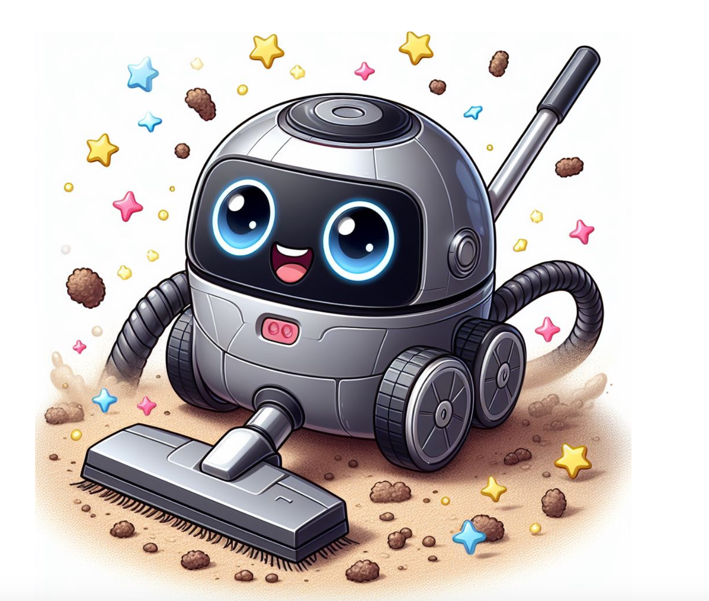
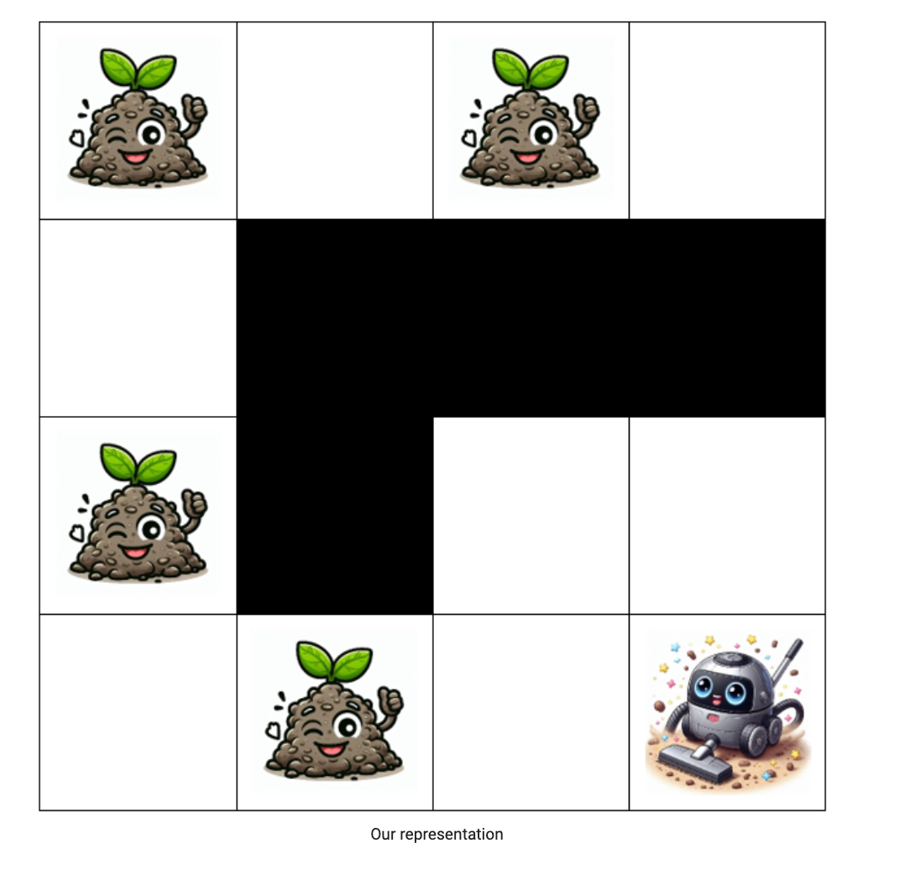

# Vacuuminator-system

## Scenario
Robotic Vacuum Cleaners are an increasingly popular tool for keeping homes and business clean. We wish to program a new robotic vacuum cleaner: The Vacuuminator.




###Representation
Like many small robotic devices, the Vacuuminator represents the world around it as a grid of small squares. In Python, this grid can be represented as a list of lists. Every position in the list of lists is represented by a string containing a single upper case character as follows:

**'X'**: The location of the Vacuuminator.  
**'D'**: Contains dirt that the Vacuuminator should clean.  
**'W'**: A wall that the Vacuuminator cannot pass through.  
**'E'**: An empty square that the Vacuuminator can pass through but does not need to clean.

For example, the world below could be represented as

```python
world = [['D', 'E', 'D', 'E'], 
['E', 'W', 'W', 'W'], 
['D', 'W', 'E', 'E'],
['E', 'D', 'E', 'X']]
```



Note that world[0][0] therefore corresponds to the position in the top-left corner of the world. A 4 x 4 world is shown, but the Vacuuminator can handle worlds of different sizes. Note that the world will always be rectangular (i.e. there will never be rows of different length in the world).

The Vacuuminator can move up, down, left and right within the world. Each move can be represented by a single character:

**<span style="color: green;">'u'</span> : for an upwards move, towards the 0th row of the world.**  
**<span style="color: blue;">'d'</span> :  for a downwards move, away from the 0th row of the world.**  
**<span style="color: olive;">'l'</span> :  for a left move, towards the 0th column of the world.**  
**<span style="color: lightcoral;">'r'</span> :  for a right move, away from the 0th column of the world.** 

If the Vacuuminator moves into a square containing dirt, it will clean the dirt, leaving the square empty once the Vacuuminator moves on.

Throughout this assignment you should assume there is only ever one Vacuuminator operating in the world.

